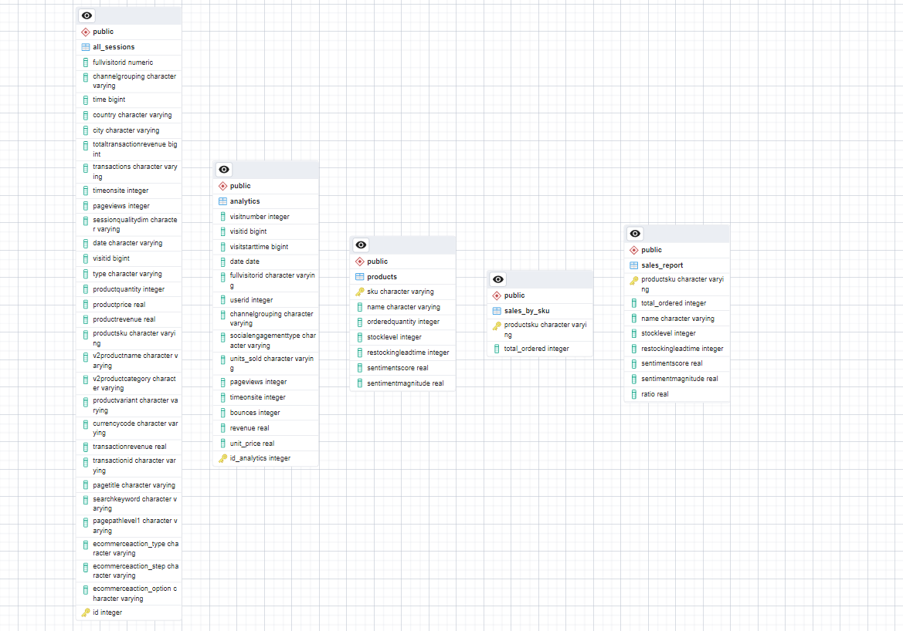

# Final-Project-Transforming-and-Analyzing-Data-with-SQL

## Project/Goals
My project goal is to drive business insights from the data to maximize revenue

## ERD Diagram

## Process
- Loading the data
- Cleaning the data (Removing duplicate rows, removing empty columns, deviding price by 10^6)
- Transforming the data
- Quality Assurance

## Results
- Top 10 best selling product
- Best Chanell driving traffic to the website
- Answering 5 questions in the starting_with_questions.md
## Challenges 
- Configuring my first github repo
- Loading data
- Defining primary key for some of the tables

## Future Goals
- Driving More complex insights
- Writing More complex SQL functions
- Doing More data cleaning
